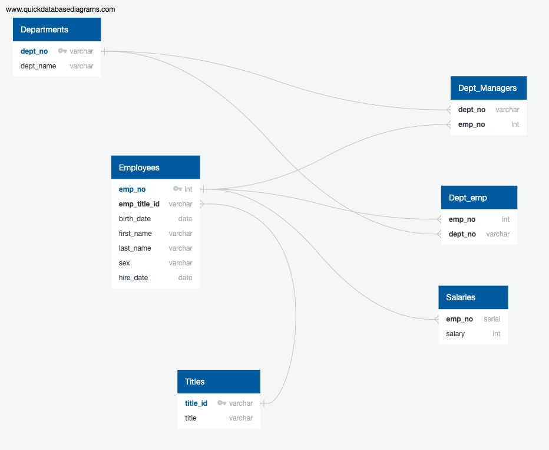
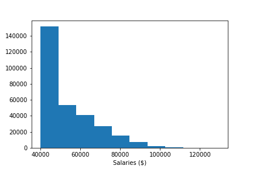
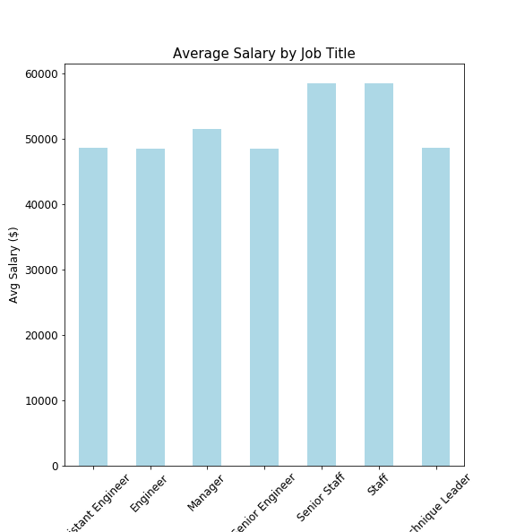

# Employee Database: SQL-Challenge
HW 7 in UCF Data Analytics &amp; Visualizations Bootcamp

# Background

It is a beautiful spring day, and it's been two weeks since we have been hired as a new data engineer at Pewlett Hackard. Our first major task is a research project on employees of the corporation from the 1980s and 1990s. All that remain of the database of employees from that period are six CSV files.

In this assignment, we design the tables to hold the data in the CSVs, import the CSVs into a SQL database, and answer questions about the data. In other words, we  perform:

1. Data Engineering

2. Data Analysis

Note: The terms "Data Modeling" & "Data Engineering," are interchangeable in this readme. Data Engineering is the more modern wording of Data Modeling.

# Data Modeling
Inspected the CSVs and sketched out an ERD of the tables using http://www.quickdatabasediagrams.com.

# Data Engineering
* Used the information we have to create a table schema for each of the six CSV files, remembering to specify data types, primary keys, foreign keys, and other constraints.
** For the primary keys check to see if the column is unique, otherwise create a composite key. Which takes to primary keys in order to uniquely identify a row.
** Be sure to create tables in the correct order to handle foreign keys.

* Imported each CSV file into the corresponding SQL table. Took care to import the data in the same order that the tables were created and accounted for the headers when importing to avoid errors.

# Data Analysis

Once the database was completed, the following analyses were performed:

1. Listed the following details of each employee: employee number, last name, first name, sex, and salary.

2. Listed first name, last name, and hire date for employees who were hired in 1986.

3. Listed the manager of each department with the following information: department number, department name, the manager's employee number, last name, first name.

4. Listed the department of each employee with the following information: employee number, last name, first name, and department name.

5. Listed first name, last name, and sex for employees whose first name is "Hercules" and last names begin with "B."

6. Listed all employees in the Sales department, including their employee number, last name, first name, and department name.

7. Listed all employees in the Sales and Development departments, including their employee number, last name, first name, and department name.

8. In descending order, list the frequency count of employee last names, i.e., how many employees share each last name.

# Pandas Analysis

Additional analyses were performed in pandas to generate a visualization of the data.

1. Imported the SQL database into Pandas. 

2. Created a histogram to visualize the most common salary ranges for employees.

3. Created a bar chart of average salary by title.

